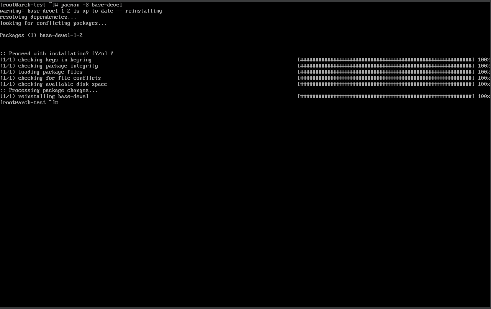
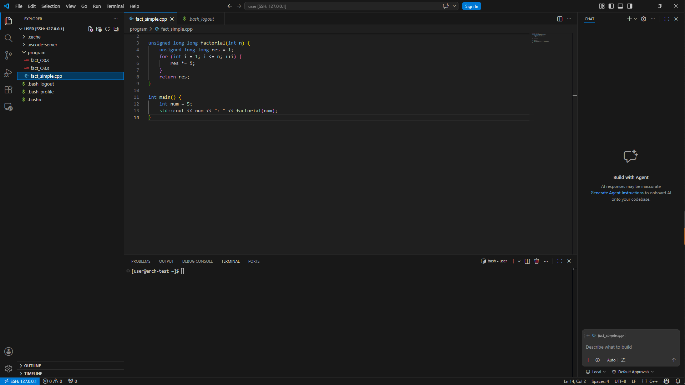

# Лабораторная 2 - Установка Linux (развертка, bootstraping)
## Создание виртуальной машины.
[Всё в видео](video/downloading_task2.mp4)

# Лабораторная работа 1 - Написание программ
Нус, буду я писать на C++(он мне сильно ближе).
## Для начала установим компилятор 

Начнём с простых программ, я решил выбрать вычисление факториала, подключился по ранее настроенному SSH и написал программу(так проще).

Теперь исходные .s файлы  с моими комментариями:
## O0:
```asm
.file	"fact_simple.cpp"
	.text
# Начало функции factorial(int n)
# В ассемблере имя искажено (mangling) до _Z9factoriali
	.globl	_Z9factoriali
	.type	_Z9factoriali, @function
_Z9factoriali:
.LFB2556:
	.cfi_startproc
	pushq	%rbp              # Сохраняем предыдущий указатель кадра стека
	movq	%rsp, %rbp        # Устанавливаем новый указатель кадра
	
	# Аргумент n (из регистра %edi) кладем в стек: [rbp-20]
	movl	%edi, -20(%rbp)   
	
	# Инициализация res = 1. Переменная res лежит в [rbp-8]
	movq	$1, -8(%rbp)      
	
	# Инициализация счетчика цикла i = 1. Переменная i лежит в [rbp-12]
	movl	$1, -12(%rbp)     
	
	jmp	.L2               # Прыгаем к проверке условия цикла
.L3:
	# ТЕЛО ЦИКЛА
	movl	-12(%rbp), %eax   # Берем i
	cltq                      # Расширяем i до 64 бит для умножения
	movq	-8(%rbp), %rdx    # Берем текущий res
	imulq	%rdx, %rax        # res * i
	movq	%rax, -8(%rbp)    # Сохраняем результат обратно в res
	
	addl	$1, -12(%rbp)     # i++ (инкремент счетчика)
.L2:
	# УСЛОВИЕ ЦИКЛА (i <= n)
	movl	-12(%rbp), %eax   # Загружаем i в регистр eax
	cmpl	-20(%rbp), %eax   # Сравниваем i с n ([rbp-20])
	jle	.L3               # Если i <= n, идем на новый круг (в .L3)
	
	# КОНЕЦ ЦИКЛА
	movq	-8(%rbp), %rax    # Кладем финальный res в rax (регистр возврата)
	popq	%rbp              # Восстанавливаем стек
	ret                       # Возвращаемся из функции
	.cfi_endproc

# Секция данных (тут хранятся строки)
	.section	.rodata
.LC0:
	.string	": "
	
	.text
	.globl	main
	.type	main, @function
main:
.LFB2557:
	.cfi_startproc
	pushq	%rbp
	movq	%rsp, %rbp
	pushq	%rbx              # Сохраняем rbx (он нам пригодится позже)
	subq	$24, %rsp         # Выделяем место на стеке
	
	# num = 5. Переменная num лежит в [rbp-20]
	movl	$5, -20(%rbp)     
	
	# Готовим вывод в std::cout (выводим число 5)
	movl	-20(%rbp), %eax
	leaq	_ZSt4cout(%rip), %rdx
	movl	%eax, %esi
	movq	%rdx, %rdi
	call	_ZNSolsEi@PLT     # Вызов оператора << для int
	
	# Выводим строку ": "
	movq	%rax, %rdx
	leaq	.LC0(%rip), %rax
	movq	%rax, %rsi
	movq	%rdx, %rdi
	call	_ZStlsISt11char_traitsIcEERSt13basic_ostreamIcT_ES5_PKc@PLT
	
	# Вызываем нашу функцию factorial(5)
	movq	%rax, %rbx        # Сохраняем объект cout для цепочки вывода
	movl	-20(%rbp), %eax
	movl	%eax, %edi        # Передаем 5 как аргумент
	call	_Z9factoriali     # Прыгаем в factorial
	
	# Выводим результат (из rax) в cout
	movq	%rax, %rsi
	movq	%rbx, %rdi
	call	_ZNSolsEy@PLT     # Вызов оператора << для unsigned long long
	
	movl	$0, %eax          # return 0
	addq	$24, %rsp
	popq	%rbx
	popq	%rbp
	ret     
	.cfi_endproc
```
## O3:
```asm
.file	"fact_simple.cpp"
	.text
#APP
	.globl _ZSt21ios_base_library_initv
#NO_APP
	.p2align 4
	.globl	_Z9factoriali
	.type	_Z9factoriali, @function
_Z9factoriali:
.LFB2605:
	.cfi_startproc
	# ПРОВЕРКА ВХОДНОГО ЗНАЧЕНИЯ (n)
	testl	%edi, %edi        # Проверяем n (аргумент лежит в %edi)
	jle	.L4               # Если n <= 0, прыгаем в .L4 (возвращаем 1)
	
	# ПОДГОТОВКА ОПТИМИЗИРОВАННОГО ЦИКЛА
	leal	1(%rdi), %esi     # Рассчитываем границу цикла (n + 1)
	andl	$1, %edi          # Проверка на четность/нечетность для оптимизации
	movl	$1, %eax          # Инициализируем временный счетчик
	movl	$1, %edx          # Инициализируем результат (res = 1)
	je	.L3               # Если n четное, сразу идем в цикл .L3
	
	# ОБРАБОТКА ПЕРВОЙ ИТЕРАЦИИ (если n нечетное)
	movl	$2, %eax          # Начинаем со 2-го элемента
	cmpq	%rsi, %rax        # Сравниваем с границей
	je	.L1               # Если закончили, выходим
	.p2align 5
	.p2align 4
	.p2align 3
.L3:
	# ГЛАВНЫЙ ЦИКЛ (Оптимизация: перемножение по два числа за шаг)
	imulq	%rax, %rdx        # res *= i
	leaq	1(%rax), %rcx     # Вычисляем (i + 1)
	addq	$2, %rax          # i += 2 (шаг цикла через два числа)
	imulq	%rcx, %rdx        # res *= (i + 1)
	cmpq	%rsi, %rax        # Проверка: достигли ли мы n?
	jne	.L3               # Если нет, повторяем цикл
.L1:
	# ВОЗВРАТ РЕЗУЛЬТАТА
	movq	%rdx, %rax        # Помещаем результат в %rax
	ret                       # Выход из функции
	.p2align 4,,10
	.p2align 3
.L4:
	# ОБРАБОТКА СЛУЧАЯ n <= 0
	movl	$1, %edx          # Результат = 1
	movq	%edx, %rax        # Возвращаем 1
	ret
	.cfi_endproc
.LFE2605:
	.size	_Z9factoriali, .-_Z9factoriali
	.section	.rodata.str1.1,"aMS",@progbits,1
.LC0:
	.string	": "
	.section	.text.startup,"ax",@progbits
	.p2align 4
	.globl	main
	.type	main, @function
main:
.LFB2606:
	.cfi_startproc
	pushq	%rbx              # Сохраняем регистр rbx в стеке
	.cfi_def_cfa_offset 16
	.cfi_offset 3, -16
	
	# ВЫВОД ЧИСЛА 5
	movl	$5, %esi          # Загружаем число 5 в аргументы
	leaq	_ZSt4cout(%rip), %rdi # Ссылка на стандартный поток cout
	call	_ZNSolsEi@PLT     # Вызов функции вывода cout << 5
	
	# ВЫВОД СТРОКИ ": "
	movl	$2, %edx          # Длина строки
	leaq	.LC0(%rip), %rsi  # Загружаем адрес строки ": "
	movq	%rax, %rbx        # Сохраняем состояние cout в %rbx
	movq	%rax, %rdi        # Передаем cout как объект для вывода
	call	_ZSt16__ostream_insertIcSt11char_traitsIcEERSt13basic_ostreamIT_T0_ES6_PKS3_l@PLT
	
	# ФАНТАСТИЧЕСКАЯ ОПТИМИЗАЦИЯ:
	# Компилятор сам посчитал факториал 5 во время компиляции!
	# Вместо вызова функции _Z9factoriali, он просто вставил готовое число 120.
	movq	%rbx, %rdi        # Снова берем cout
	movl	$120, %esi        # Загружаем готовый результат 120 (5!) в аргументы
	call	_ZNSo9_M_insertIyEERSoT_@PLT # Выводим число 120
	
	xorl	%eax, %eax        # Обнуляем %eax (return 0)
	popq	%rbx              # Восстанавливаем rbx
	.cfi_def_cfa_offset 8
	ret                       # Завершение программы
	.cfi_endproc
.LFE2606:
	.size	main, .-main
	.ident	"GCC: (GNU) 16.1.1 20260430"
	.section	.note.GNU-stack,"",@progbits
```
